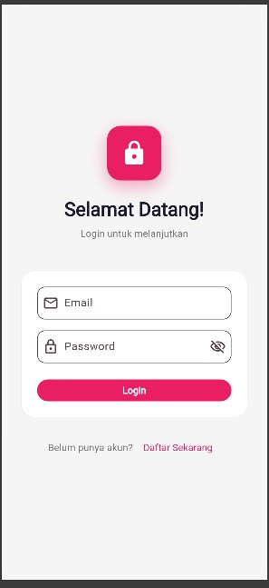
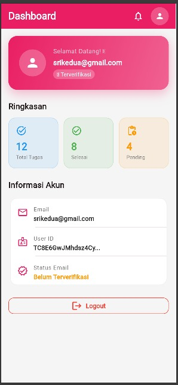

# 📱 UTS - Aplikasi Flutter Login & Dashboard

Proyek ini dibuat untuk **Ujian Tengah Semester (UTS)** mata kuliah **Pemrograman Mobile Lanjutan**.  
Aplikasi dikembangkan menggunakan **Flutter** dengan integrasi **Firebase Authentication** untuk login dan register.

---

## 🖼️ Tampilan Aplikasi

### 🔹 Halaman Login

### 🔹 Halaman Dashboard

---

## 👩‍💻 Pengembang
**Nama:** Sriyanti  
**NIM:** 1125170133  
**Kelas:** Mobile Lanjutan

---

✨ *Project UTS Flutter - Login & Dashboard*
